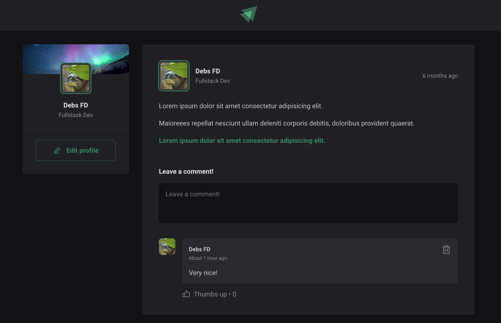

<h1 align="center">
   Feed Blog
</h1>

<p align="center">
  👏 Time to share knowledge and accomplishments!
</p>


<div align="center">
   
</div>

## :rocket: Technologies
This project was made using the follow technologies:

* [TypeScript](https://www.typescriptlang.org/)      
* [Vite](https://vitejs.dev/)      
* [CSS Modules](https://github.com/css-modules/css-modules)


## :computer: How to run

```bash
# Clone repository
$ git clone https://github.com/debfdias/ignite-reactjs-22/

# Access folder 
$ cd p01
```

```bash
# Install dependencies
$ yarn

# Run aplication
$ yarn dev

# Access application locally
```

## :page_facing_up: License

This project is licensed under the [MIT license](./LICENSE).
